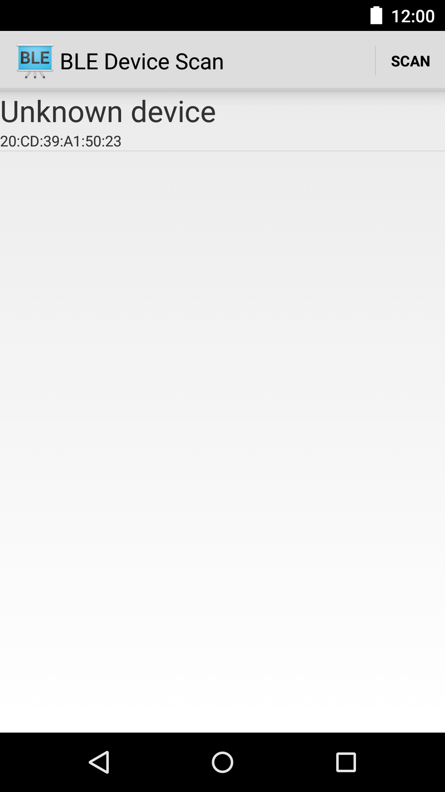

Connect a BLE device to Android and send data to AWS IoT
=========================================================================

This app is part of the [Activity Recognition project](https://github.com/riccardo97p/IoT_ActivityRecognition), it demonstrates how to use the Bluetooth LE Generic Attribute Profile (GATT) to transmit data from a BLE connected device to AWS IoT.

## Technologies
* [Android Studio](https://developer.android.com/studio)
* [Amazon Web Services IoT](https://aws.amazon.com/iot/?nc1=f_ls)
* [Amazon Web Services DynamoDB](https://aws.amazon.com/dynamodb/?nc1=f_ls)

Be careful: for this project we have used free trial periods (12 months for AWS IoT/DynamoDB), after that period you have to pay for them. 

## Screenshots

  

## How to use
Follow these steps to run the app:
* Import the app on Android Studio.
* Change ```private static final String CUSTOMER_SPECIFIC_IOT_ENDPOINT = "YOUR_ENDPOINT";``` in the `AWSServiceClient.java` file with your AWS IoT Endpoint.
* Change ```final String topic = "YOUR_TOPIC";``` in the `AWSServiceClient.java` with the name of your topic.
* Change
```  
    "PoolId": "YOUR_POOLID",
    "Region": "YOUR_REGION"
```
in the `res/raw/awsconfiguration.json` file with your PoolID and Region values.
* Build and Run the app.

For further information about these steps see the [GitHub](https://github.com/riccardo97p/IoT_ActivityRecognition) and [Hackster.io](https://www.hackster.io/andreanapoletani/activity-recognition-using-genuino-101-and-aws-iot-fbeea2) of the project.

# References
# Contacts
* [Andrea Napoletani](https://www.linkedin.com/in/andrea-napoletani-aa0b87166/)
* [Alessandro Giannetti](https://www.linkedin.com/in/alessandro-giannetti-2b1864b4/)
* [Riccardo Pattuglia](https://www.linkedin.com/in/alessandro-giannetti-2b1864b4/)

# Useful Links
* [GitHub project page](https://github.com/riccardo97p/IoT_ActivityRecognition)
* [Hackster blog post](https://www.hackster.io/andreanapoletani/activity-recognition-using-genuino-101-and-aws-iot-fbeea2)

Feel free to contact us for further information!
